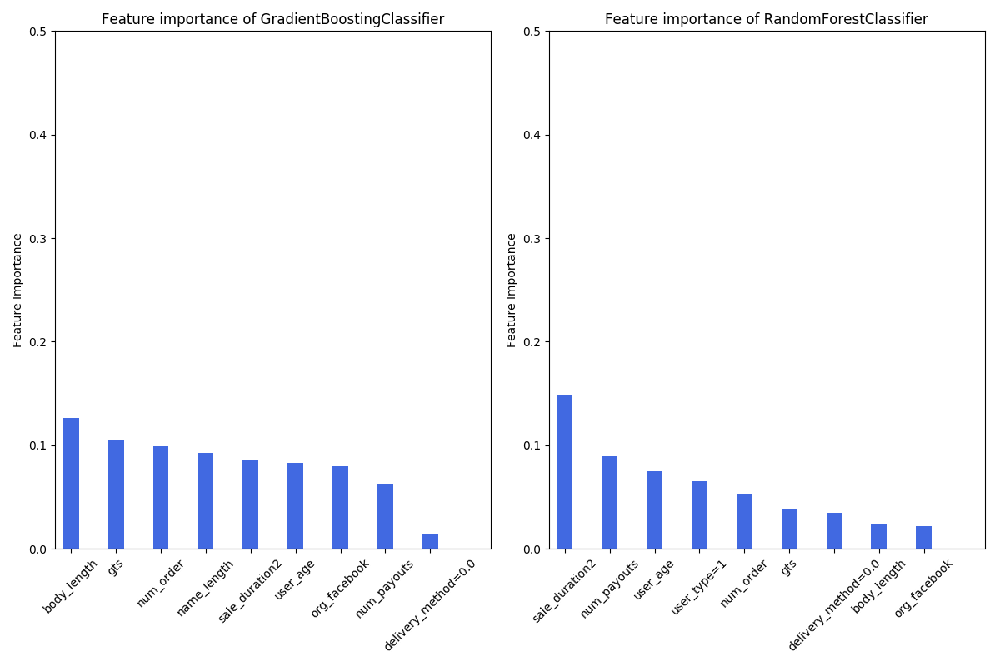
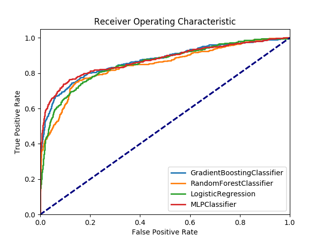

## Model Description

An overview of our chosen “optimal” modeling technique:

* process flow
	* Load original data from a json file
	* Convert `acct_type` column into target label
	* Build pipeline
	* Cleaning and prepossing
	* Modeling
	* Rebulding the train set with balanced classes
	* Predict probabilites

* preprocessing
	* Turn raw text from a Pandas DataFrame into features we can feed into our classifier
		* Parse HTML Text
		* Vectorize raw text

* accuracy metrics selected
	* precision, recall, f1-score
	* fbeta_score

* validation and testing methodology
	* Logistic Regression
	* Decision Trees
		* RandomForestClassifier
		* AdaBoostClassifier
		* GradientBoostingClassifier
	* Support Vector Classification (SVC)
	* Neural Network - MLPClassifier
* parameter tuning involved in generating the model
	* MLP(hiddenlayersizes=(30,30), activation='relu', solver='adam',
            batchsize=1000, learningrate='constant', alpha=.0001, max_iter=1000)
* further steps we might have taken if we were to continue the project
	* Zack really wanted to do an RNN ;)

